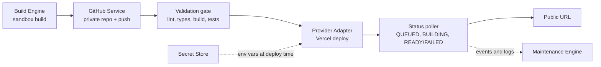

# Deployment Architecture (v1)

**Owner:** Intern 2 (Deployment Engine)
**Status:** Draft, Day 1
**Scope:** Repo → Build → Deploy → URL for Stage 1. One provider, one stack.

## 1. Goal

Take a project that has been built in the sandbox and get it to a public, working URL, with a recovery path when something fails. Every step reports its state so the Maintenance Engine can react.

## 2. Flow

Step by step:

1. **Build Engine** produces a project that installs and builds in the sandbox.
2. **GitHub Service** creates a private repo (`tl-{project_id}`) and pushes the code. AI changes go to a separate branch; `main` is protected.
3. **Validation gate** (Day 3) allows deploy only if lint, type-check, build and tests pass.
4. **Provider Adapter** triggers a Vercel deployment from the repo, injecting env vars from the Secret Store.
5. **Status poller** tracks the deployment until it is `READY` or `FAILED`.
6. On `READY`, the public URL is stored on the project and the Maintenance Engine is notified.

## 3. Components

| Component | Responsibility | Location (proposed) |
|---|---|---|
| Deployment Engine | Orchestrates the flow above; owns deployment records | `backend/app/deployment/engine.py` |
| Provider Adapter | Provider-agnostic interface: `deploy()`, `status()`, `logs()`, `rollback()` | `backend/app/deployment/adapters/` |
| GitHub Service | Create private repo, push code, manage branches | `backend/app/deployment/github_service.py` |
| Secret Store | Encrypted per-project env vars and tokens; decrypt only at deploy time | `backend/app/deployment/secrets.py` |
| Status / Log reporter | Emits deployment events and logs in the shared log schema | `backend/app/deployment/reporter.py` |

Adapters: `FakeAdapter` (canned responses for other interns and tests) and `VercelAdapter` (real, completed Day 3).

## 4. Interfaces

**Inputs from Build Engine:** `project_id`, `tenant_id`, repo files, build output, `deploy.json` (from Day 2: framework, Node version, output directory, build and start commands).

**Outputs to Maintenance Engine:**

- Deployment events: `QUEUED`, `BUILDING`, `READY`, `FAILED`, `ROLLED_BACK`
- Logs as `{project_id, level, source, message, timestamp}`
- Public URL and deployment ID

The project-level state (`BUILDING / READY / DEPLOYING / LIVE / ERROR / MAINTENANCE`) is owned by the Maintenance Engine. The Deployment Engine only emits events; it does not write project state directly.

## 5. Security rules

- Tokens and env values are encrypted at rest (Fernet; key from environment or secret manager, never in git).
- Tokens and secrets are never logged. A log filter masks `ghp_*` and `github_pat_*` patterns, and tests assert this.
- Secrets are never written into the repo. Only `.env.example` (names, no values) is committed.
- Every table and endpoint includes `tenant_id` and an authorization check.
- Secrets are scoped per project.

## 6. Failure handling

| Failure | Detection | Response |
|---|---|---|
| Repo creation fails (name collision, rate limit, bad token) | GitHub API error | Retry with backoff (max 3). On name collision, append a suffix. After retries, mark deployment `FAILED` with a clear reason and emit an event. |
| Push fails | Git exit code | Retry once, then `FAILED`. Never leave a half-pushed repo without recording it. |
| Validation gate fails | Lint / type / build / test result | Do not deploy. Send the structured error to the Build Engine for the fix loop (max 3 attempts, then human escalation). |
| Provider build fails | Status `FAILED` + build logs | Collect logs, classify the root cause (missing env, port, Node version, build script) and send a fix suggestion to the Build Engine. |
| Deploy succeeds but health check fails | Post-deploy check (Maintenance) | Roll back to the last good deployment and emit `ROLLED_BACK`. |
| Provider API down or rate limited | HTTP 5xx / 429 | Retry with backoff; keep the deployment `QUEUED`; alert after repeated failure. |

Rule: failures are handled by improving the platform, not by manual code edits.

## 7. Decision log

| # | Decision | Reason |
|---|---|---|
| 1 | Provider = **Vercel** | Generated apps are Next.js; the frontend already runs on Vercel; good REST API for deployments, logs and rollback. |
| 2 | One provider only | Stabilize one path first. A second adapter is planned for Week 2. |
| 3 | Adapter interface | Keeps the engine independent of the provider. |
| 4 | GitHub PAT (fine-grained) for Day 1 | Fastest to start. Move to a GitHub App later for per-tenant access. |
| 5 | Fernet for secret encryption | Simple, well-tested, sufficient for MVP. Revisit with a managed secrets service later. |
| 6 | Deployment Engine emits events; Maintenance owns state | Single owner for state transitions avoids conflicting writes. |

## 8. Open questions

- `PROJECT_CONTEXT.md` describes a flow of repo scan → fix → PR, while the 7-day plan describes Prompt → Build → Deploy. Confirm which one the deployment engine serves first.
- Which Vercel team/account will own deployments for the beta?
- Org-owned repos or user-owned repos? (`/orgs/{org}/repos` vs `/user/repos`)
- Should preview deployments use a separate Vercel project from production?

## 9. Out of scope for Day 1

Live Vercel deploys (Day 3), rollback logic (Day 3-4), approval gates (Day 4), custom domains, multi-provider support.